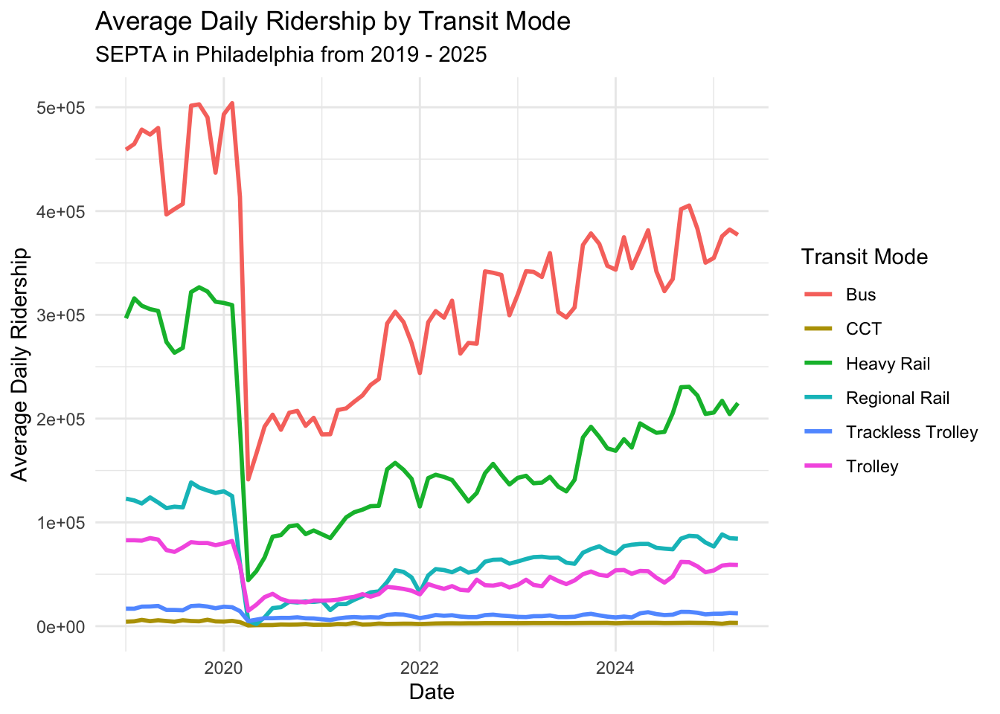
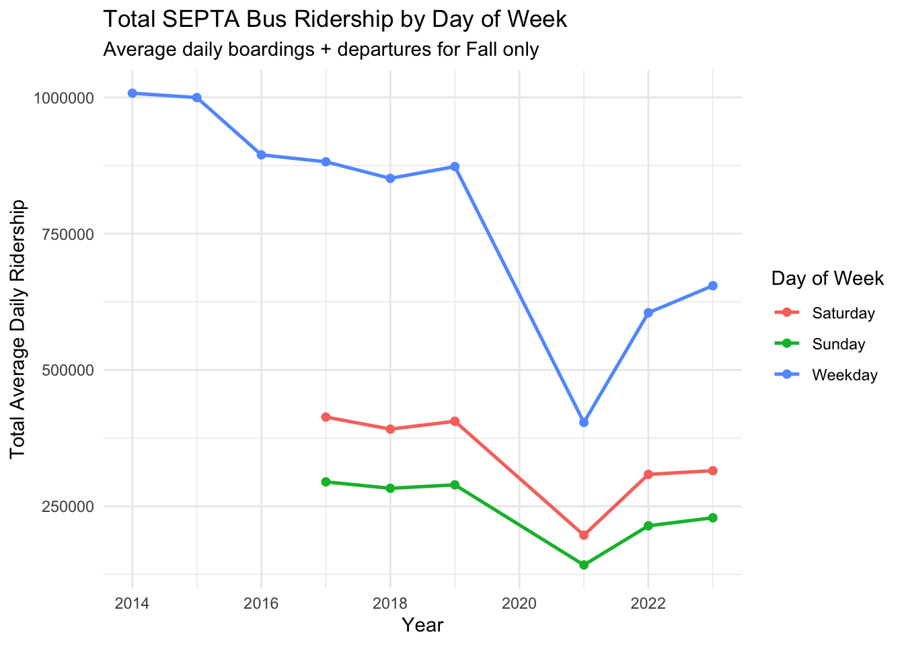
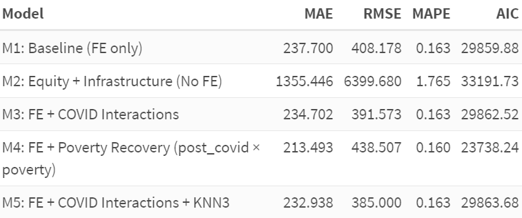
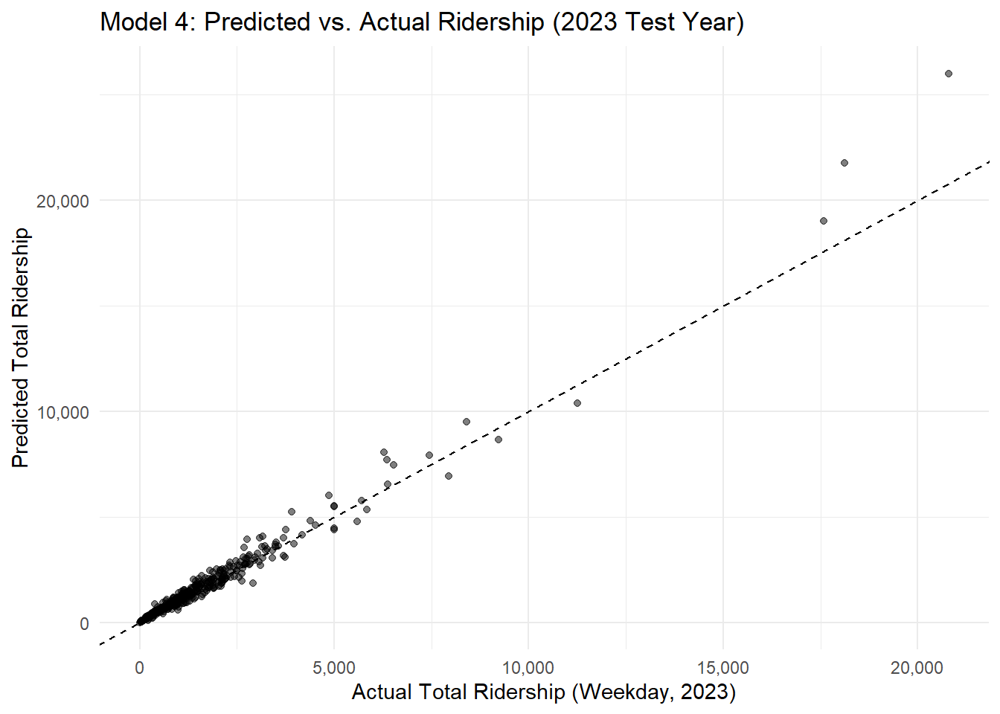
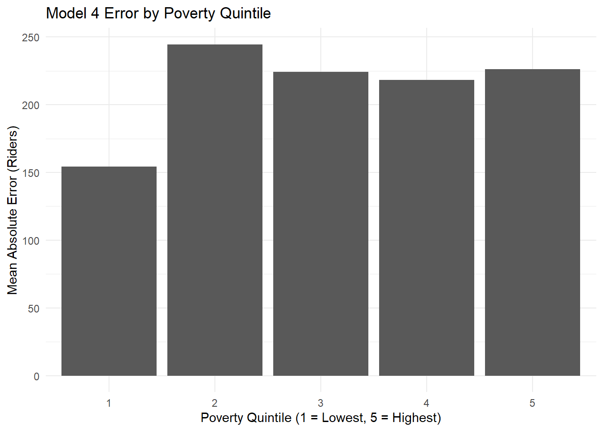
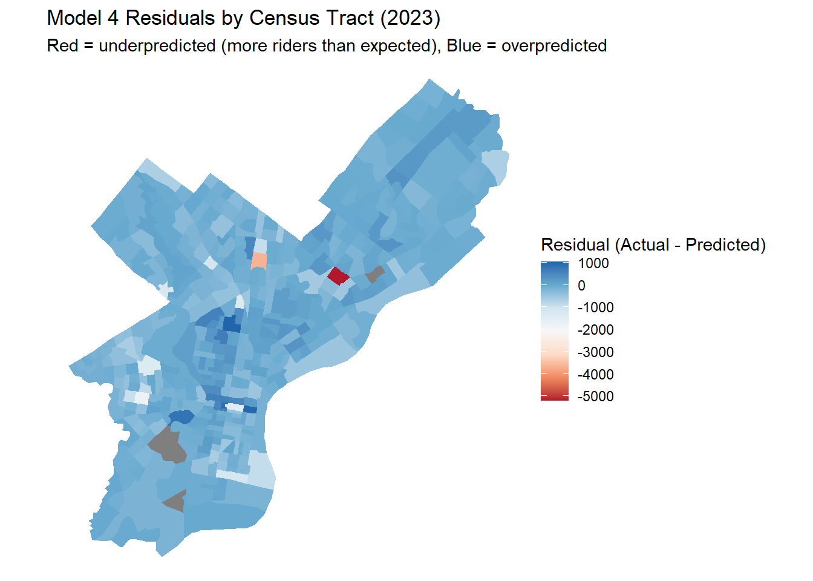
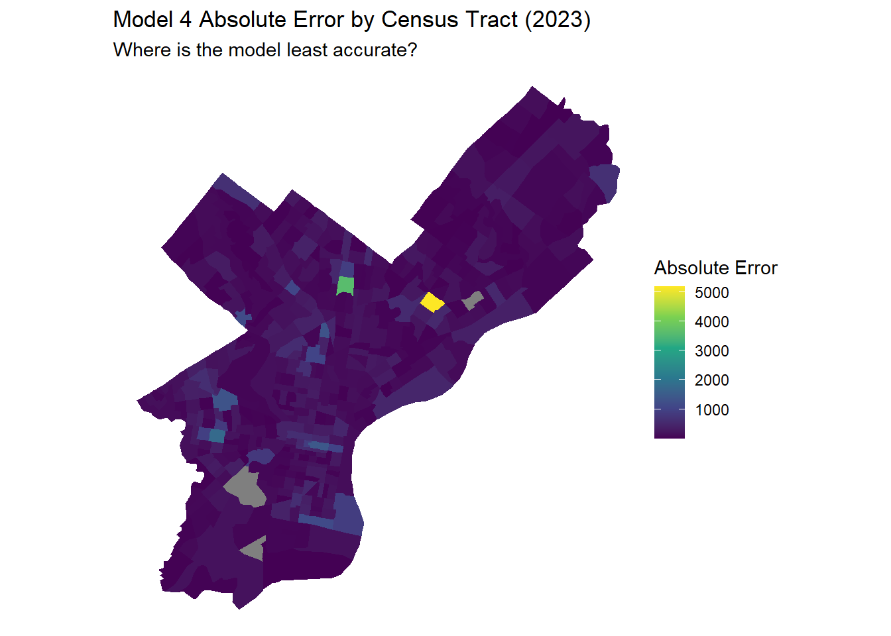

```{r setup, include=FALSE}
library(knitr)
library(ggplot2)
library(dplyr)
library(scales)
```

```{css, echo=FALSE}
.reveal .slides section {
  font-size: 0.85em;
}

.reveal ul {
  margin-top: 0.5em;
  margin-bottom: 0.5em;
}

.reveal li {
  margin-bottom: 0.3em;
}

.reveal p {
  margin-top: 0.5em;
  margin-bottom: 0.5em;
}

.reveal h2 {
  font-size: 1.5em;
}

.reveal h3 {
  font-size: 1.2em;
}
```

---

## Predicting Transit Recovery to Support Equitable Bus Service

- **Policy question:** How can SEPTA prioritize service & shelter investments post-COVID?
- **Outcome:** Weekday bus ridership by census tract (2017–2023)
- **Goal:** Provide a **predictive tool** for:
  - Prioritizing neighborhoods for service restoration    
  - Targeting investments in high-poverty, transit-dependent areas

---

## The Policy Problem

### Why does this matter?

- COVID drastically altered **travel behavior**
- SEPTA faces difficult decisions:
  - Where to restore service?
  - Where to place shelters?
- High-poverty, transit-dependent tracts risk being **left behind**

- **Decision our model informs:**  
- **Which tracts should SEPTA prioritize for additional service and shelter investments in 2024-2025?**

---

## Data & Spatial Unit

### The “Secret Ingredient” + Enhancements

- **Primary dataset:** SEPTA Bus Ridership (APC), by tract, 2017–2023  
- **Spatial unit:** Census tracts (static)

- **Additional data sources:**

- ACS poverty, vehicle access, population density  
- Bus stop and shelter inventory  
- Distance to rail  
- Indego bike share KNN-3 distance  

---

## Average Daily Ridership by Transit Mode

```{r, eval=TRUE, out.width='80%'}

```

---

## Exploratory Data Analysis

- ### Key EDA Insights

- Severe **shock** in 2019 → 2021: ~60% drop in ridership 
- Uneven **recovery** in 2021 → 2023: some tracts recovered faster
- Spatial variation in:
  - Ridership levels
  - Shelter coverage
  - Poverty, vehicle availability

---

## Exploratory Data Analysis (cont.)

<div style="text-align: center;">

</div>

- **EDA informed modeling decisions:**

- Predict **counts** → Poisson / Negative Binomial  
- Include **tract fixed effects**  
- Add **equity-focused interactions**  

---

## Modeling Strategy

- **Outcome:** total weekday ridership (count)
- **Models tested:**
  - Poisson (overdispersed)
  - Negative Binomial (final)
- **Features included:**
  - Trend, post_covid  
  - % poverty, % no vehicle, population density  
  - Stop/shelter density
  - Distance to rail  
  - KNN-3 Indego distance  
  - Fixed effects for tracts  
  - Equity interactions  

```{r, eval=FALSE}
# total_ridership ~ trend + post_covid +
#   pct_poverty + pct_no_vehicle + pct_sheltered +
#   poverty_x_sheltered +
#   post_covid:pct_poverty +
#   census_tract_id
```

---

## Train/Test Design

### How we validated

- **Train:** 2017–2019 (pre-COVID) and 2021–2022 (recovery)  
- **Test:** 2023 (true held-out year)

Validation metrics:
- Mean Absolute Error (MAE)
- Root Mean Squared Error (RMSE)
- Mean Absolute Percentage Error(MAPE)
- Akaike Information Criterion (AIC)

```{r, eval=TRUE, fig.align='center', out.width='95%'}

```

---

## Model Performance (Held-out 2023)

### Best Models: Model 4 & Model 5

These models used:
- Fixed effects  
- COVID × Poverty interaction  
- Infrastructure variables  
- KNN-3 Indego distance (Model 5)

```{r, eval=FALSE}
knitr::include_graphics("figs/model_performance.png")
```

**Finding:**  
Equity-informed models consistently performed best.

---

## Key Findings: What the Model Tells Us

### 1. Fixed Effects Are Essential
- Without tract FE: MAE = 1,355 (high)
- With tract FE: MAE = 214-238 (good)
- Unobserved tract characteristics significantly impact ridership

### 2. Recovery Varies by Poverty
- High-poverty tracts show **slightly larger post-COVID drop**
- Suggests differential recovery needs by poverty level 

### 3. Shelter Effects Depend on Context
- Shelters associated with higher ridership overall, but this relationship is much weaker in high-poverty tracts ... Why? 

---

## Interpreting Model 4 Coefficients: Main Effects (on log scale)

- **`trend = 0.21`**: Each year → ~21% growth (baseline trend)
- **`post_covid = -1.13`**: Post-COVID period → ~68% drop from trend
- **`pct_poverty = 346.90`**: Higher poverty → much higher baseline ridership (transit dependence)
- **`pct_no_vehicle = 61.94`**: No vehicle → higher ridership
- **`pct_sheltered = 85.09`**: More shelters → higher ridership

---

## Interpreting Model 4 Coefficients:Key Interactions (on log scale)

- **`post_covid:pct_poverty = -0.10`**:  
  High-poverty tracts had **slightly larger post-COVID drop**
  
- **`poverty_x_sheltered = -14,768`**:  
  Shelter effect is **much weaker in high-poverty areas** which suggests shelters work differently in high-poverty contexts 

**Interpretation:**  
The model captures that recovery patterns and infrastructure effects vary by neighborhood context.

---

## Equity & Error Patterns

### Understanding error distributions

::: {.columns}
::: {.column width="50%"}
```{r, eval=TRUE, out.width='100%'}

```
:::

::: {.column width="50%"}
```{r, eval=TRUE, out.width='100%'}

```
:::
:::

Questions explored:

- Does the model underpredict high-poverty tracts?
- Are errors spatially clustered?  
- Is the model equitable in practice?

---

## Spatial Error Diagnostics

::: {.columns}
::: {.column width="50%"}
```{r, eval=TRUE, out.width='100%'}

```
:::

::: {.column width="50%"}
```{r, eval=TRUE, out.width='100%'}

```
:::
:::

**Insight:**  
Some high-need neighborhoods were consistently underpredicted → equity implications.

---

## Policy Recommendations

### How the City Should Use the Model

1. **Prioritize underpredicted, high-poverty tracts** for restoration  
2. Identify “fragile” tracts with weak recovery  
3. Use model as a **screening tool**, not the final decision-maker  
4. Update annually with new APC + ACS  
5. Pair predictions with community input  

---

## Limitations 

### Limitations

- **Data issues:** APC quality, ACS lag, spatial autocorrelation (Moran's I = 0.145)
- **Time period:** 2021-2023 combines drop + recovery into one period
- **Behavioral changes:** WFH patterns not captured

### What the Model Cannot Do

- **Causal inference:** Why do shelters matter less in high-poverty areas?
- **Recovery speed:** Can't separate initial drop from recovery rate
- **Optimal policies:** Predicts outcomes, doesn't prescribe solutions

**Key point:** Model is a **prediction tool**, not a causal analysis tool.

---

## Ethical Concerns & Safeguards 

### Ethical Concerns 

- Underpredicting marginalized areas risks disinvestment
- Existing inequities may be reinforced

### Safeguards

- Annual fairness audits
- Community engagement required
- "Do no harm" rule for high-poverty tracts
- Use as screening tool, not final decision-maker

---

## Implementation & Next Steps

### How SEPTA Can Use This

- Forecast ridership for planning and budgeting  
- Dashboard for planners  
- Integrate with stop-level redesign efforts  

Future improvements:
- Monthly data  
- Weather & job center integration  
- Spatial lag/error models  

---

## Backup Slides (Q&A)

### Why Negative Binomial?

- Poisson dispersion test → overdispersion  
- NB provides more reliable inference  

### Model Validation

- Train/test split  
- FE structure  
- Equity-focused interactions  

```{r, eval=FALSE}
# broom::tidy(m4_nb) |> head(10)
```

### Shark Tank Q&A Practice

- “Why this model?”  
- “How do you know it's not overfitting?”  
- “What could go wrong if used incorrectly?”  
- “How do you ensure equity?”